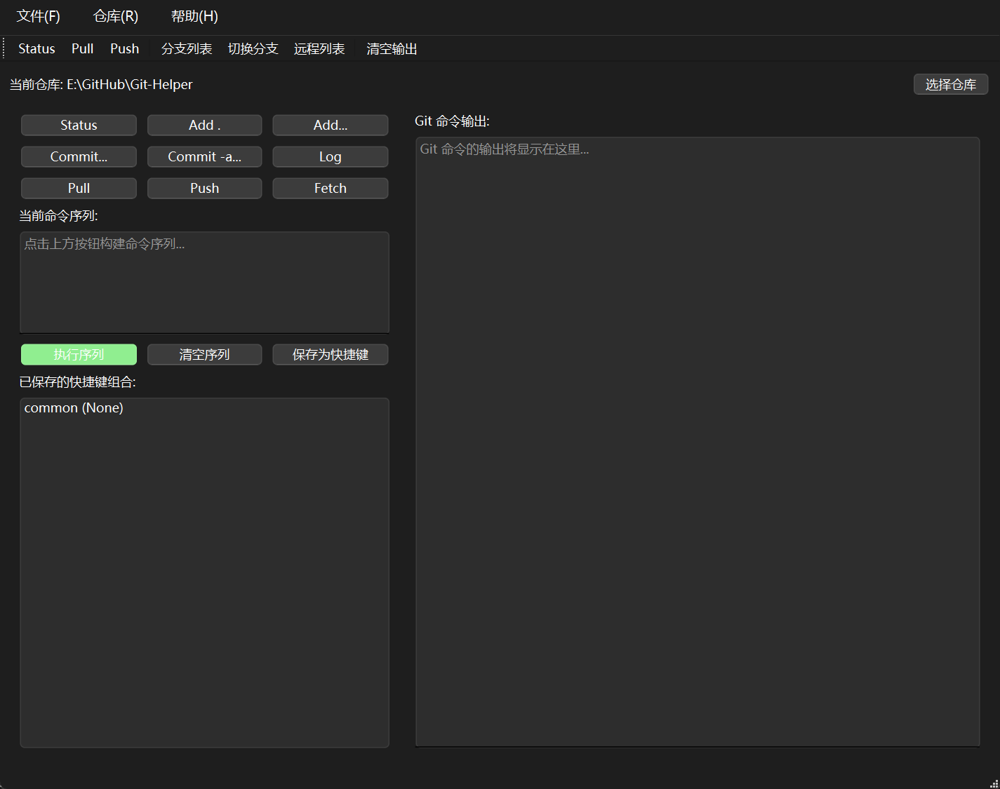
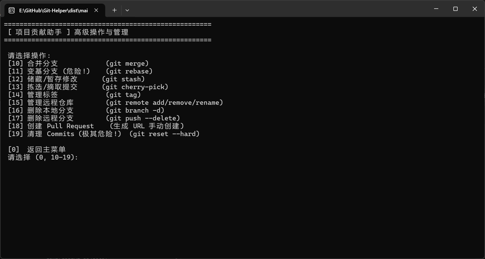
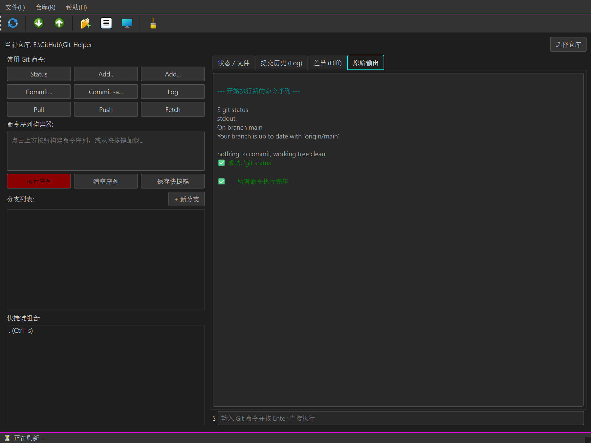

# 🌟 git-helper: 命令行 Git 助手

## 参考文档

1. [Git 官方文档](https://git-scm.com/docs/git#_git_commands) - **学习 Git 的权威指南**
2. [LazyGit](https://github.com/jesseduffield/lazygit) - **一个简单易用的终端 Git UI 工具，提高 Git 操作效率**


[](https://github.com/424635328/Git-Helper/stargazers)
[](https://github.com/424635328/Git-Helper/network/members)

**重要提示: 如果您 Fork 了本仓库，请将 README 中的相关链接替换为您自己的 GitHub 用户名和仓库名称！**

## 📚 目录

- [参考文档](#参考文档)
- [🚀 项目简介](#-项目简介)
- [✨ 主要特性](#-主要特性)
- [✅ 为什么选择 git-helper?](#-为什么选择-git-helper)
- [📝 项目结构](#-项目结构)
- [📚 Git 操作参考手册](#-git-操作参考手册)
- [📦 安装](#-安装)
  - [1. 克隆仓库](#1-克隆仓库)
  - [2. 安装依赖](#2-安装依赖)
  - [3. 配置 config.yaml](#3-配置-configyaml)
  - [4. (可选) 添加到 PATH 或创建别名](#4-可选-添加到-path-或创建别名)
- [📖 使用方法](#-使用方法)
  - [主菜单操作](#主菜单操作)
  - [高级操作菜单](#高级操作菜单)
- [📸 截图示例](#-截图示例)
- [🤝 贡献](#-贡献)
- [📄 许可协议](#-许可协议)
- [🙏 鸣谢](#-鸣谢)

---

## 🚀 项目简介

`git-helper` 是一个简单的 Python 命令行工具，旨在通过提供一个友好的分层菜单界面来简化常见的 Git 操作，特别是对于参与开源项目或其他协作开发的贡献者。无需记忆复杂的 Git 命令和参数，只需在你的 Git 仓库目录下运行 `git-helper` 脚本，按照菜单指引即可完成日常的 Git 工作流程。

无论您是 Git 新手，还是希望提高日常操作效率的开发者，`git-helper` 都能为您提供帮助。它特别适合处理 Fork/Pull Request 模式下的代码同步、分支管理和提交推送等任务。

## ✨ 主要特性

`git-helper` 集成了以下常用的 Git 功能，并通过清晰的菜单方式提供：

### 基础操作 (主菜单选项 1-5)

- **查看仓库状态:** 快速了解工作区和暂存区的当前状态 (`git status`)。
- **查看提交历史:** 以简洁或图形化方式浏览项目的提交记录 (`git log`)。
- **查看文件差异:** 对比工作区、暂存区或不同提交/分支之间的文件改动 (`git diff`)。
- **添加修改:** 将文件添加到暂存区，准备提交 (`git add`)。
- **提交修改:** 提交暂存区的更改，并添加提交信息 (`git commit`)。

### 分支与同步 (主菜单选项 6-9)

- **创建/切换分支:** 创建新分支或切换到已有分支 (`git checkout -b` / `git checkout`)。
- **拉取远程更改:** 从远程仓库拉取最新代码 (`git pull`)。
- **推送本地分支:** 将本地分支推送到远程仓库 (`git push`)。
- **同步 Fork (Upstream):** 一键从原始仓库 (upstream) 拉取最新代码到本地主分支，再推送到自己的 Fork 仓库 (origin) 的主分支，保持 Fork 与上游同步。**（需要预先配置好 `upstream` 远程仓库）**

### 高级操作与管理 (通过主菜单选项 10 进入子菜单)

- **合并分支:** 将一个分支的更改合并到当前分支 (`git merge`)，并提供冲突解决提示。
- **变基分支 (危险!):** 将当前分支的修改基于另一个分支的最新状态进行重放，使提交历史更线性 (`git rebase`) **⚠ 操作危险，会重写历史，切勿对已推送到公共仓库的分支使用！**
- **储藏/暂存修改:** 临时保存工作区和暂存区的修改，以便进行其他操作 (`git stash`)，支持储藏列表、保存、应用、pop 和删除。
- **拣选/摘取提交:** 将某个特定提交的更改应用到当前分支 (`git cherry-pick`)，并提供冲突解决提示。
- **管理标签:** 列出、创建、删除本地/远程标签 (`git tag`, `git push --tags`, `git push --delete tag`)。
- **管理远程仓库:** 列出、添加、删除、重命名远程仓库配置 (`git remote`)，包含方便设置 `upstream` 的选项。
- **删除本地分支:** 删除不再需要的本地分支 (`git branch -d`)，支持安全删除和强制删除。
- **删除远程分支:** 删除远程仓库上的分支 (`git push --delete`)。
- **创建 Pull Request:** 生成 GitHub Pull Request 的创建 URL，方便快速发起贡献。**（需要正确配置 Fork 用户名和原始仓库信息）**
- **清理 Commits (极其危险!):** 使用 `git reset --hard` 硬重置仓库状态，**⚠ 会永久丢弃指定数量的最新提交和本地未提交更改！请务必备份！**

## ✅ 为什么选择 git-helper?

- **简化复杂命令:** 将常用的、参数较多的 Git 命令封装到简单的菜单选项中，降低使用门槛。
- **分层菜单:** 将高级操作组织到子菜单中，使主菜单更简洁，操作逻辑更清晰。
- **降低错误率:** 减少手动输入命令可能造成的拼写错误或参数遗漏。
- **流程引导:** 对于同步 Fork、PR 创建等流程提供清晰的步骤和指引。
- **内置安全提示:** 对如 `rebase`, `reset --hard` 等危险操作提供醒目的警告和多次确认机制，最大程度降低误操作风险。
- **易于扩展:** 基于 Python 编写，采用模块化设计，您可以轻松理解代码并根据自己的需求添加或修改功能。
- **聚焦协作:** 特别优化了 Fork、Upstream 同步和 PR 创建相关的流程，提升开源贡献效率。
- **社区脚本收纳:** 提供 `others/` 目录，方便社区贡献独立的、不直接集成到主菜单的实用脚本，共享更多便民工具。

## 📝 项目结构

```bash
.
├── config.yaml              # 用户自定义配置文件
├── main.py                  # 程序入口，加载配置，驱动主菜单
├── git_operation_archive.md # Git 操作详细档案
├── others/                  # 存放社区贡献的独立脚本和便民工具
└── src/
    ├── __init__.py          # 使 src 成为一个 Python 包
    ├── config_manager.py    # 负责加载和管理 config.yaml 中的配置
    ├── utils.py             # 通用工具函数 (如清屏)
    ├── git_utils.py         # 负责执行 Git 命令的核心函数，处理错误输出
    ├── basic_operations.py  # 包含基础 Git 操作的函数 (status, log, diff, add, commit)
    ├── branch_sync.py       # 包含分支与同步操作的函数 (checkout, pull, push, sync_fork)
    ├── gui                  # 包含图形化界面相关的代码
    └── advanced/            # 高级操作与管理功能的子目录
        ├── __init__.py      # 使 advanced 成为一个 Python 包
        ├── driver.py        # 高级操作的入口，显示高级菜单并分发调用
        ├── branch_ops.py    # 分支高级操作 (merge, rebase)
        ├── stash_ops.py     # 储藏操作 (stash)
        ├── cherry_pick_ops.py # 拣选操作 (cherry-pick)
        ├── tag_ops.py       # 标签操作 (tag)
        ├── remote_ops.py    # 远程仓库管理操作 (remote, setup_upstream)
        ├── branch_cleanup.py # 分支删除操作 (local/remote branch -d/-D, push --delete)
        ├── pr_ops.py        # Pull Request 创建操作 (生成 URL)
        └── dangerous_ops.py # 危险操作 (reset --hard)
        
```

## 📚 Git 操作参考手册

想要深入了解 `git-helper` 各个菜单项对应的 Git 命令、其背后原理和更多细节？请查阅我们的详细 Git 操作档案：

👉 [**Git 操作档案 (git_operation_archive.md)**](docs/git_operation_archive.md)

这个档案为你提供了每个操作的命令解释、用途、潜在风险和实用建议，帮助你更好地理解和使用 Git。

## 📦 安装

### 1. **克隆仓库:**

```bash
git clone https://github.com/424635328/Git-Helper.git
cd Git-Helper
```

### 2. **安装依赖:**

确保您已安装 Python 3.6 或更高版本。本项目依赖 PyYAML 库，请安装：

```bash
pip install PyYAML
```

### 3. **配置 config.yaml:**

在 `Git-Helper` 项目的**根目录**下创建一个名为 `config.yaml` 的文件（如果不存在），用于存储默认配置。使用以下模板并根据实际情况修改：

```yaml
# config.yaml
# 项目贡献助手配置文件

# 你的 GitHub 用户名，用于构建 Pull Request URL
# 例如: default_fork_username: octocat
default_fork_username: username # 更新为你的用户名

# Upstream 原始仓库的地址，用于设置 upstream remote 和推断 default_base_repo
# 可以是 HTTPS 或 SSH 地址
# 例如: default_upstream_url: git@github.com:torvalds/linux.git
# 或者: default_upstream_url: https://github.com/torvalds/linux.git
# 请替换为你实际需要同步的原始仓库地址
default_upstream_url: git@github.com:upstream_owner/upstream_repo.git

# 原始仓库的名称，格式为 owner/repo，用于构建 Pull Request URL
# 例如: default_base_repo: torvalds/linux
# 如果 default_upstream_url 配置正确，程序会尝试从 URL 中提取该值作为默认值。
# 如果无法提取或未配置 default_upstream_url，请手动设置此项。
# 请替换为你实际需要同步的原始仓库 owner/repo
default_base_repo: upstream_owner/upstream_repo

# 默认的主分支名称 (例如 main, master)
default_branch_name: main
# 注意:
# 在程序运行时，会提示你输入 GitHub 用户名和原始仓库名称，
# 这些输入会覆盖配置文件中的默认值，并存储在内存中的 config 字典中供本次运行使用。
```

正确配置 `default_fork_username`, `default_upstream_url`, `default_branch_name` 可以大大简化日常使用。

### 4. **(可选) 添加到 PATH 或创建别名:**

为了更方便地在任何 Git 仓库目录下运行 `git-helper`，您可以将脚本所在的目录添加到系统的 PATH 环境变量中，或者为运行 `main.py` 创建一个别名。

- **添加到 PATH:** (不同操作系统方法不同，请自行搜索 "如何添加目录到环境变量 PATH")
- **创建别名 (Bash/Zsh 示例):** 将以下行添加到您的 `~/.bashrc` 或 `~/.zshrc` 文件中：

  ```bash
  alias gh="python /path/to/your/Git-Helper/main.py"
  ```

  然后运行 `source ~/.bashrc` 或 `source ~/.zshrc` 使更改生效。之后就可以直接在终端输入 `gh` 在任何 Git 仓库目录下运行脚本了。

## 📖 使用方法

1. **打开终端:** 进入你想要操作的 Git 仓库目录。
2. **运行脚本:**

   ```bash
   python /path/to/your/Git-Helper/main.py
   # 或者如果你设置了别名或添加到 PATH:
   # gh
   ```

3. **首次运行提示:** 如果 `config.yaml` 不存在或某些关键配置缺失，或者你想临时使用不同的值，脚本会在启动时提示你输入 GitHub 用户名和原始仓库名称 (owner/repo)。这些信息会覆盖 `config.yaml` 中的默认值并用于当前会话。
4. **主菜单:** 脚本会显示一个主菜单，列出基础操作、分支与同步操作，以及一个进入高级操作菜单的选项。
5. **选择操作:** 输入对应操作的编号并按回车键。

### 主菜单操作

- 输入 `1` 到 `9` 可以直接执行对应的基础操作或分支/同步操作。
- 输入 `0` 退出程序。
- 输入 `10` 进入**高级操作菜单**。

### 高级操作菜单

- 当你选择主菜单的 `10` 时，会进入高级操作的子菜单。
- 输入 `10` 到 `19` 可以执行对应的高级操作。
- 输入 `0` 返回到主菜单。

脚本会根据你选择的操作，提示你输入必要的信息，例如分支名称、提交信息、远程仓库名称等。命令执行后，脚本会打印 Git 命令的输出（成功或失败信息、错误详情等）。大部分操作完成后会暂停，按任意键继续。

## 📸 截图示例

### 示例图片


_主菜单界面示例_


_高级操作菜单界面示例 (进入选项 10 后)_


_查看仓库状态示例_

## 🤝 贡献

### ✨ 贡献者

<!-- ALL-CONTRIBUTORS-LIST:START - Do not remove or modify this section -->
<!-- prettier-ignore-start -->
<!-- markdownlint-disable -->
<table>
  <tbody>
    <tr>
      <td align="center" valign="top" width="14.28%">
        <a href="https://github.com/424635328">
          
        </a>
        <br />
        <sub><b>424635328</b></sub>
        <br />
      </td>
      <!-- 如果还有其他贡献者，他们的条目会放在这里 -->
      <!-- <td align="center" valign="top" width="14.28%"><a href="https://github.com/另一用户名">...</a></td> -->
    </tr>
    <!-- 如果贡献者过多，会自动换行到新的 <tr> -->
  </tbody>
</table>

<!-- markdownlint-enable -->
<!-- prettier-ignore-end -->

<!-- ALL-CONTRIBUTORS-LIST:END -->

感谢所有让本项目变得更好的贡献者！

非常欢迎社区的贡献！如果您有改进意见、发现 Bug 或想添加新功能，请随时提交 Issue 或 Pull Request。

1. Fork 本仓库 [`https://github.com/424635328/Git-Helper`](https://github.com/424635328/Git-Helper)。
2. 创建一个新的特性分支 (`git checkout -b feature/your-feature-name`)。
3. 在 `src/` 目录下找到合适的文件（或创建新的文件/目录）实现您的功能，或者将独立的便民脚本放在 `others/` 文件夹中。
4. 添加或修改相应的测试（如果适用）。
5. 提交您的修改 (`git commit -am 'feat: Add new feature'`)。请使用清晰的提交信息。
6. 将分支推送到您的 Fork 仓库 (`git push origin feature/your-feature-name`)。
7. 创建一个 Pull Request 到本仓库。

请尽量遵循 PEP 8 编码规范，并为您的修改添加适当的文档或注释，特别是对于新的函数或模块。如果修改或新增了 Git 命令，请考虑更新 [Git 操作档案](docs/git_operation_archive.md)。

---

**关于贡献独立脚本的说明:**

如果您贡献的是不直接集成到主菜单中的、独立的、或特定场景下的便民脚本（即“特殊类型”脚本），请将其放在项目根目录的 `others/` 文件夹中。
这些脚本可以是任何语言编写的，只要它们与 Git 操作相关且能提供便利。
请考虑在 `others/` 文夹内提供一个简短的 README (`others/README.md`) 说明每个脚本的用途、依赖和使用方法。
这有助于其他用户和维护者理解和使用您的贡献。

---

## 📄 许可协议

本项目遵循 GPL v3 许可协议。
详情请参见 [LICENSE](LICENSE) 文件。

## 🙏 鸣谢

感谢所有使用、支持以及为 `git-helper` 贡献的朋友们！

---
