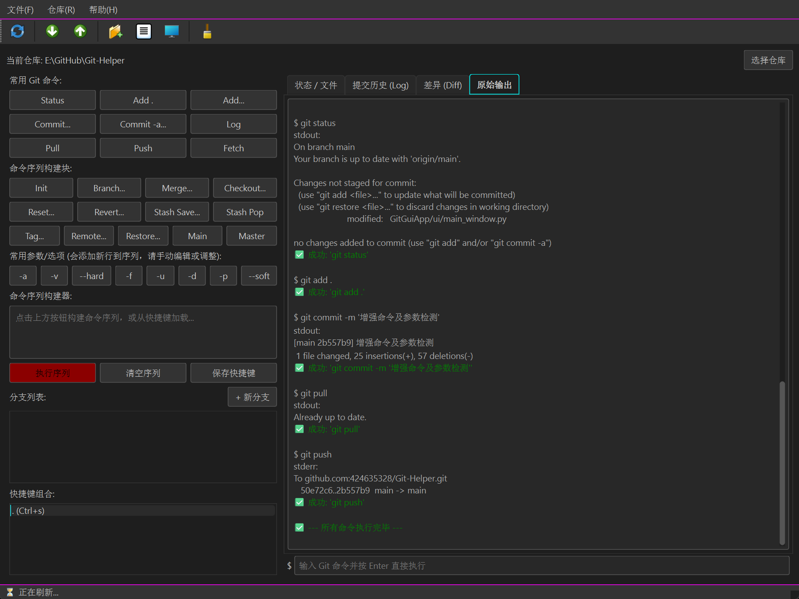

# 🌟 git-helper: 命令行 Git 助手


[](https://github.com/YOUR_GITHUB_USERNAME/git-helper/stargazers)
[](https://github.com/YOUR_GITHUB_USERNAME/git-helper/network/members)

**请将 `YOUR_GITHUB_USERNAME` 替换为您的实际 GitHub 用户名！**

## 🚀 项目简介

`git-helper` 是一个简单的 Python 命令行工具，旨在通过提供一个友好的菜单界面来简化常见的 Git 操作，特别是对于参与开源项目或其他协作开发的贡献者。无需记忆复杂的 Git 命令和参数，只需运行 `git-helper`，按照菜单指引即可完成日常的 Git 工作流程。

无论您是 Git 新手，还是希望提高日常操作效率的开发者，`git-helper` 都能为您提供帮助。它特别适合处理 Fork/Pull Request 模式下的代码同步、分支管理和提交推送等任务。

## ✨ 主要特性

`git-helper` 集成了以下常用的 Git 功能，并通过菜单方式提供：

**--- 基础操作 ---**

- **查看仓库状态:** 快速了解工作区和暂存区的当前状态 (`git status`)。
- **查看提交历史:** 以简洁或图形化方式浏览项目的提交记录 (`git log`)。
- **查看文件差异:** 对比工作区、暂存区或不同提交/分支之间的文件改动 (`git diff`)。
- **添加修改:** 将文件添加到暂存区，准备提交 (`git add`)。
- **提交修改:** 提交暂存区的更改，并添加提交信息 (`git commit`)。

**--- 分支与同步 ---**

- **创建/切换分支:** 创建新分支或切换到已有分支 (`git checkout -b` / `git checkout`)。
- **拉取远程更改:** 从远程仓库拉取最新代码 (`git pull`)。
- **推送本地分支:** 将本地分支推送到远程仓库 (`git push`)。
- **同步 Fork (Upstream):** 一键从原始仓库 (upstream) 拉取最新代码并推送到自己的 Fork 仓库 (origin) 的主分支，保持 Fork 与上游同步。

**--- 高级操作与管理 ---**

- **合并分支:** 将一个分支的更改合并到当前分支 (`git merge`)，并提供冲突解决提示。
- **变基分支 (危险!):** 将当前分支的修改基于另一个分支的最新状态进行重放，使提交历史更线性 (`git rebase`)。**⚠ 操作危险，会重写历史，请谨慎使用！**
- **储藏/暂存修改:** 临时保存工作区和暂存区的修改，以便进行其他操作 (`git stash`)，支持储藏列表、保存、应用、pop 和删除。
- **拣选/摘取提交:** 将某个特定提交的更改应用到当前分支 (`git cherry-pick`)，并提供冲突解决提示。
- **管理标签:** 列出、创建、删除本地/远程标签 (`git tag`, `git push --tags`, `git push --delete tag`)。
- **管理远程仓库:** 列出、添加、删除、重命名远程仓库配置 (`git remote`)，包含方便设置 `upstream` 的选项。
- **删除本地分支:** 删除不再需要的本地分支 (`git branch -d`)，支持安全删除和强制删除。
- **删除远程分支:** 删除远程仓库上的分支 (`git push --delete`)。
- **创建 Pull Request:** 生成 GitHub Pull Request 的创建 URL，方便快速发起贡献。
- **清理 Commits (极其危险!):** 使用 `git reset --hard` 硬重置仓库状态，**会永久丢弃指定数量的最新提交和本地未提交更改！请务必备份！**

## ✅ 为什么选择 git-helper?

- **简化复杂命令:** 将常用的、参数较多的 Git 命令封装到简单的菜单选项中。
- **降低错误率:** 减少手动输入命令可能造成的拼写错误或参数遗漏。
- **流程引导:** 对于同步 Fork、PR 创建等流程提供清晰的步骤和指引。
- **内置安全提示:** 对如 `rebase`, `reset --hard` 等危险操作提供醒目的警告和确认机制。
- **易于扩展:** 基于 Python 编写，您可以轻松理解代码并根据自己的需求添加或修改功能。
- **聚焦协作:** 特别优化了 Fork、Upstream 同步和 PR 创建相关的流程。

## 📦 安装

1.  **克隆仓库:**

    ```bash
    git clone https://github.com/YOUR_GITHUB_USERNAME/git-helper.git
    cd git-helper
    ```

    **请将 `YOUR_GITHUB_USERNAME` 替换为您的实际 GitHub 用户名！**

2.  **安装依赖:**
    确保您已安装 Python 3.6 或更高版本。然后安装 PyYAML 库：

    ```bash
    pip install PyYAML
    ```

3.  **配置 (可选但推荐):**
    在 `git-helper` 脚本所在的目录创建一个 `config.yaml` 文件，用于存储默认配置，例如您的 GitHub 用户名、上游仓库地址等。这可以减少每次运行脚本时的输入。

    ```yaml
    # config.yaml
    default_fork_username: your_github_username # <-- 替换为你的 GitHub 用户名
    default_upstream_url: git@github.com:upstream_owner/upstream_repo.git # <-- 替换为你要贡献的原始仓库的 SSH 或 HTTPS 地址
    # default_base_repo: upstream_owner/upstream_repo # <-- 如果 default_upstream_url 能正确提取出 owner/repo，则无需此项
    default_branch_name: main # <-- 替换为原始仓库的主分支名称，如 main 或 master
    ```

    请根据实际情况修改 `config.yaml` 中的值。

4.  **(可选) 添加到 PATH 或创建别名:**
    为了更方便地在任何 Git 仓库目录下运行 `git-helper`，您可以将脚本所在的目录添加到系统的 PATH 环境变量中，或者为脚本创建一个别名。

    - **添加到 PATH:** (不同操作系统方法不同，请自行搜索)
    - **创建别名 (Bash/Zsh 示例):** 将以下行添加到您的 `~/.bashrc` 或 `~/.zshrc` 文件中：
      ```bash
      alias gh="/path/to/your/git-helper/git_helper.py"
      ```
      然后运行 `source ~/.bashrc` 或 `source ~/.zshrc` 使更改生效。之后就可以直接在终端输入 `gh` 运行脚本了。

## 📖 使用方法

1.  **打开终端:** 进入你想要操作的 Git 仓库目录。
2.  **运行脚本:**
    ```bash
    python /path/to/your/git-helper/git_helper.py
    # 或者如果你设置了别名或添加到 PATH:
    # gh
    ```
3.  **首次运行提示:** 如果 `config.yaml` 不存在或某些关键配置缺失，脚本可能会提示你输入 GitHub 用户名和原始仓库名称。这些信息主要用于生成 Pull Request URL。
4.  **主菜单:** 脚本会显示一个主菜单，列出所有可用的 Git 操作，并配有编号。
5.  **选择操作:** 输入对应操作的编号并按回车键。
6.  **根据提示输入:** 脚本会根据你选择的操作，提示你输入必要的信息，例如分支名称、提交信息、远程仓库名称等。
7.  **查看结果:** 命令执行后，脚本会打印 Git 命令的输出（成功或失败信息、错误详情等）。
8.  **返回/退出:** 大部分操作完成后会暂停，按任意键返回主菜单。输入 `0` 选择退出。

## 📸 截图示例 (建议添加)

- **主菜单截图:** 展示清晰的菜单选项列表。
- **`git status` 结果截图:** 显示脚本执行 `git status` 后的输出。
- **`git log` 结果截图:** 显示图形化日志输出的例子。
- **同步 Fork 流程截图 (可选):** 展示执行同步 Fork 选项时的步骤输出。
- **Pull Request URL 生成截图:** 展示生成的 PR URL。
- **危险操作警告截图:** 突出显示 `rebase` 或 `reset --hard` 的警告信息。

**(请自行替换以下占位符为实际的截图图片)**


_主菜单界面示例_


_查看仓库状态示例_


_查看提交历史示例_

## 🤝 贡献

欢迎任何形式的贡献！如果您有改进意见、发现 Bug 或想添加新功能，请随时提交 Issue 或 Pull Request。

1.  Fork 本仓库。
2.  创建一个新的特性分支 (`git checkout -b feature/your-feature-name`)。
3.  提交您的修改 (`git commit -am 'feat: Add new feature'`)。
4.  将分支推送到您的 Fork 仓库 (`git push origin feature/your-feature-name`)。
5.  创建一个 Pull Request。

请尽量遵循 PEP 8 编码规范，并为您的修改添加适当的文档或注释。

## 📄 许可协议

本项目采用 [The Unlicense](https://unlicense.org/) 许可协议。这意味着您可以自由地复制、修改、分发本项目的代码，而无需任何许可或归属要求。本项目内容被声明进入公共领域（Public Domain）。

详情请参见 [LICENSE](LICENSE) 文件。

## 🙏 鸣谢

感谢所有使用和支持 `git-helper` 的朋友们！
